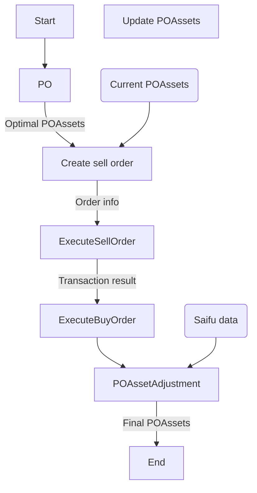

# New OrderPublish

## Concept

新POでは最適化結果として、BaseAsset単位での最適保有量がわかる。したがって、現在の保有量と比較するだけで必要な購入量が計算できる。また、POモデルは売却->購入の順序でモデル化されている。したがってOrderPublishでもこの流れに沿う必要がある。

依然、購入時に必要なアセットを取得できない場合や、過去のタイムスロットに微小な量のアセットが残る可能性がある。これらはOrder実行後などでケアが必要。

## Flow
POも含めると下記の流れでOrderPublishする。
流れを説明する：

### 1. PO
POから最適なPOAssetsが出力される。ここで各アセットの各タイムスロットでの最適保有量と最適な新規購入量がわかる。

### 2. OrderAmountCalc
現在のPOAssetsと最適POAssetsを比較し、各アセットごとの売却量を計算。購入量は各アセットの新規購入量になる。購入量は成行き注文の場合ではprice slippageにより希望のBase asset単位の購入量を実現できない可能性あり。Quote asset単位での注文を行うことで、注文が通らない可能性を考慮した若干少なめの注文などは不要になると思われる。

### 3. ExecuteSellOrder
まずは売り注文を実行する。売却量と売り注文の成否からPOAssetを更新する。またSaifuデータも更新する。

### 4. ExecuteBuyOrder
売り注文の結果得たQuoteAssetの量を考慮して買い注文を実行する。買い注文は、得られるProfitの大きいアセットから実行する。買い注文の結果得たBaseAssetの量と成否からPOAssetを更新する。またSaifuデータも更新する。

### 5. POAssetAdjustment
SaifuデータとPOAssetの整合性が取れるように各アセットのタイムスロットを調整する。また、一定以上時間が経つか量が微小なタイムスロットはマージする。そして出来上がった最終的なPOAssetsを保存し次回のPOに備える。

## Input

