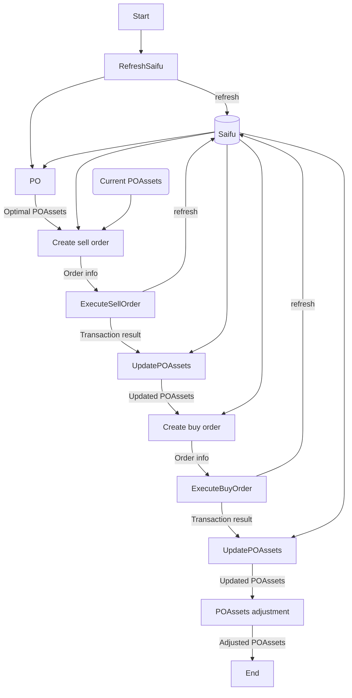

# New OrderPublish

## Concept

新POでは最適化結果として、BaseAsset単位での最適保有量がわかる。したがって、現在の保有量と比較するだけで必要な購入量が計算できる。また、POモデルは売却->購入の順序でモデル化されている。したがってOrderPublishでもこの流れに沿う必要がある。

依然、購入時に必要なアセットを取得できない場合や、過去のタイムスロットに微小な量のアセットが残る可能性がある。これらはOrder実行後などでケアが必要。

## Flow
POも含めると下記の流れでOrderPublishする。
流れを説明する：

### 1. PO
POから最適なPOAssetsが出力される。ここで各アセットの各タイムスロットでの最適保有量と最適な新規購入量がわかる。

### 2. Create sell order
現在のPOAssetsと最適POAssetsを比較して売却量を決める。各アセットの各スロットでの保有量の差分の合計が売却量になる。
最新のSaifuでの保有量を超えないように売却量を制限する。

### 3. Execute sell order
OrderInfoに基づいて売却する。Base asset量指定で成り行き注文。売却後は、Transaction resultsとSaifuデータを更新する。

### 4. Update POAssets (sell)
各アセットごとの売却完了量に応じて、Current POAssetを更新する。一番タイムスタンプの古いスロットから売却要求量を満たすようにスロットを更新する。

### 5. Create buy order
現在のQuote asset保有量と各アセットの購入要求量から、各アセットを新規購入する量をQuote asset単位で決定する。
売却が不完全な場合などで必要な購入資金を準備できない場合は、Quote asset単位で購入割合が高いアセットを優先的に割り当てる。足りない場合は足りる分だけ購入する。

### 6. Execute buy order
OrderInfoに基づいて購入する。資金不足による購入失敗の影響を最小化するため買い割合の多いアセットから買い注文を実行する。Quote asset単位で購入するので足りなくなることはないと思われる。購入できない場合は、購入しない。こういった場合が多く発生するようなら購入量を若干小さくするマージンを設ける。また、Saifuデータを更新する。

### 7. Update POAssets (buy) 
Transaction infoに基づいて各アセットに新規購入タイムスロットを作成し、Current POAssetを更新する。
ログとして要求のOptimal POAssetsとCurrent POAssetsの差分を計算する？目標値との差分的な感じ。

### 8. POAssets adjustment
Saifuとの整合性を取る。加えて、CurrentPOAssetのうち、一定期間以上経過したタイムスロット、一定値以下の価値しか持たないタイムスロットをマージする。更新したCurrentPOAssetを出力する。

## Input
